# Expense Tracker App 💵
**Full Stack Application — React + Azure Functions + Azure Cosmos DB (NoSQL)**

This repository contains a **complete full-stack Expense Tracker application** built with:

- **Frontend:** React  
- **Backend:** Azure Functions (Node.js)  
- **Database:** Azure Cosmos DB (NoSQL API)

The project demonstrates **cloud-native backend development**, **serverless APIs**, and **secure environment configuration** using Azure services.

---

## 📌 Features

- User authentication (register & login)
- Expense tracking by date and category
- Savings and loan tracking
- User-specific settings
- Cloud-hosted serverless backend
- Secure database access using environment variables

---

## 📁 Repository Structure

```text
expense-tracker-app/
│
├── expense-tracker-frontend/
│   ├── src/
│   ├── public/
│   ├── package.json
│   └── .env.local
│
├── expense-tracker-backend/
│   ├── src/
│   │   └── functions/
│   │       ├── createUser/
│   │       ├── loginUser/
│   │       ├── addExpense/
│   │       ├── createSettingsForUser/
│   ├── host.json
│   ├── local.settings.json
│   ├── package.json
│   └── .env.local
│
└── README.md
```

---

## 🧰 Tech Stack

### Frontend
- React
- React Router
- Fetch API
- Chart.js

### Backend
- Azure Functions (Node.js)
- Azure Cosmos DB (NoSQL API)
- VS Code Azure Extensions

---

## ☁️ Backend Deployment (Azure)

### 1️⃣ Create Azure Resources

#### Create Azure Cosmos DB (NoSQL)
- Resource type: **Azure Cosmos DB**
- API: **NoSQL**
- Database: `expenseTrackerDB`
- Container: `expenses`
- Partition key: `/userId`

📸 Screenshots:
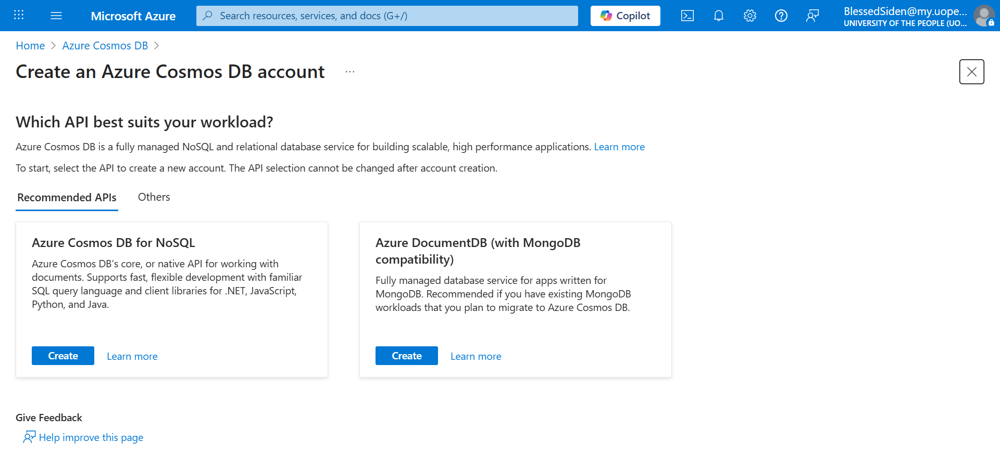
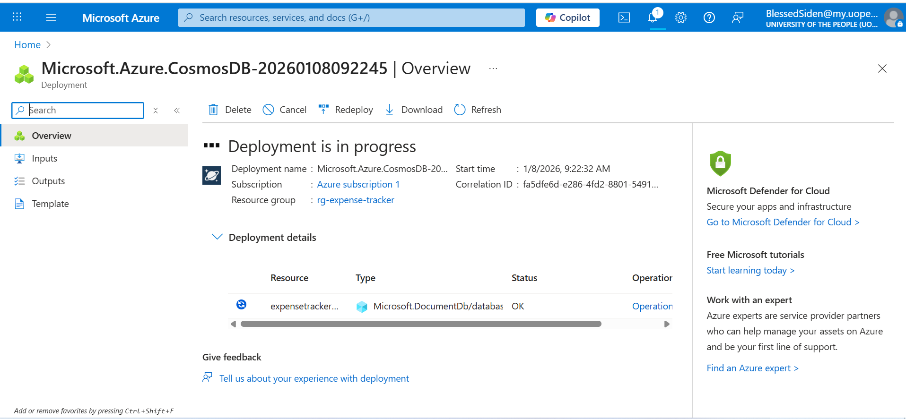
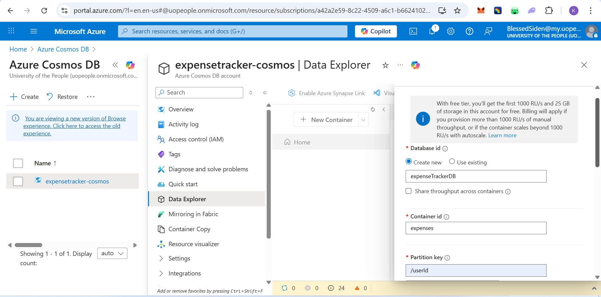
---

### 2️⃣ Copy Cosmos DB Connection String

- Azure Portal → Cosmos DB → **Keys**
- Copy **Primary Connection String**

📸 Screenshot:
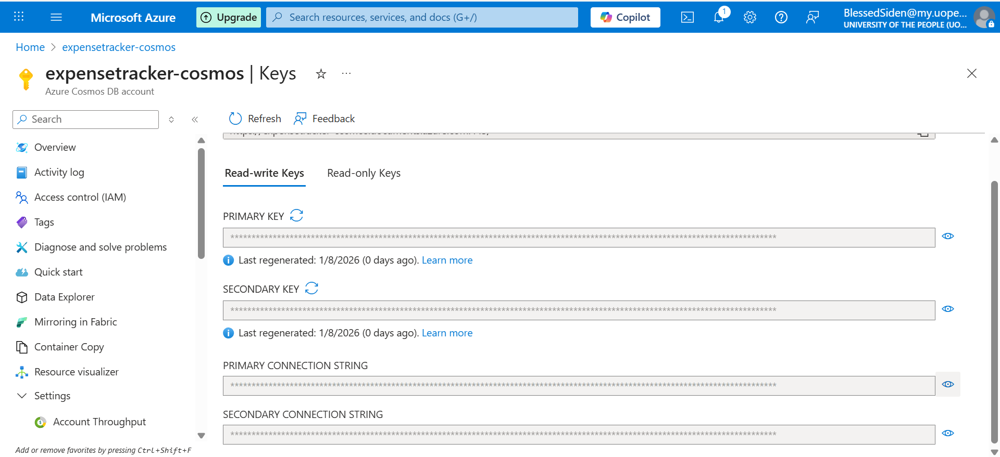

---

### 3️⃣ Create Azure Function App

- Runtime stack: **Node.js**
- Hosting plan: **Consumption**
- OS: **Linux**

📸 Screenshot:
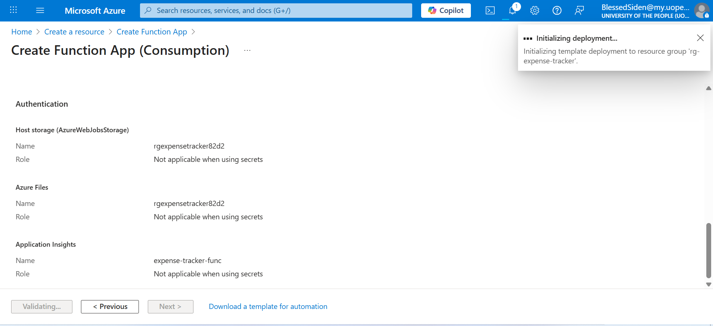

---

### 4️⃣ Configure Environment Variable

Azure Portal → Function App → **Configuration** → **Application Settings**

```env
COSMOS_CONNECTION=AccountEndpoint=...;AccountKey=...
```

📸 Screenshot:
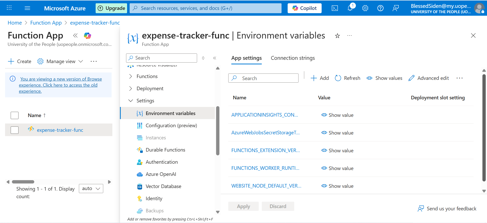
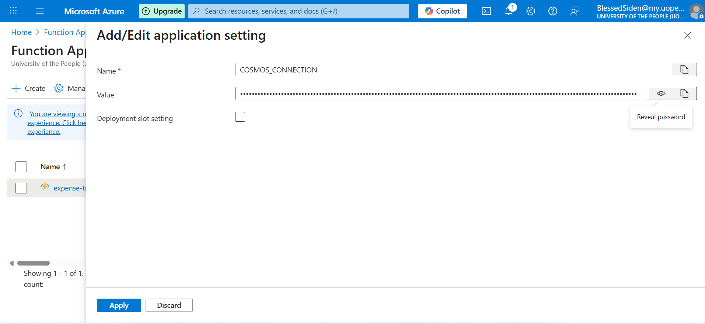

---

### 5️⃣ Connect Function App to VS Code

- Install Azure Tools Extension
- Sign in to Azure
- Manage functions remotely

📸 Screenshots:
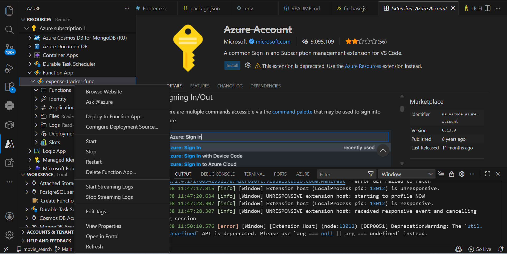
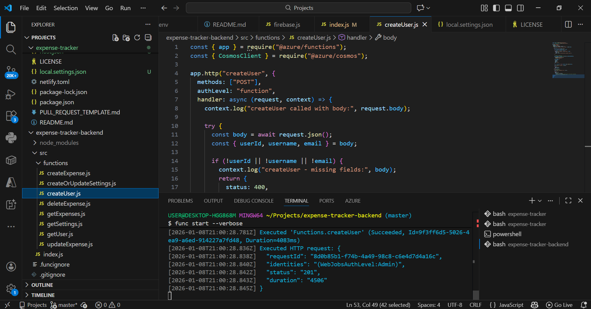
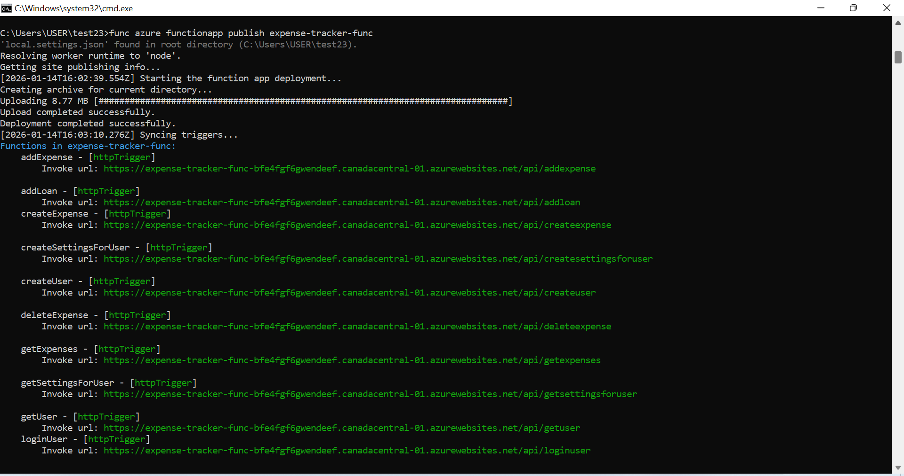

---

### Clone Repository
```bash
git clone https://github.com/BlessedSiden1234/Expense-tracker-app.git
```

### 6️⃣ Run Backend Locally

```bash
cd expense-tracker-backend
npm install
func start
```

Backend URL:
```
http://localhost:7071
```

---

## ⚛️ Frontend Setup

```bash
cd expense-tracker-frontend
npm install
npm start
```

Frontend URL:
```
http://localhost:3000
```

### Frontend Environment Variable

```env
REACT_APP_API_BASE_URL=https://<your-function-app>.azurewebsites.net/api
```

---

## 🖼️ Frontend Screenshots

**Home Page**  
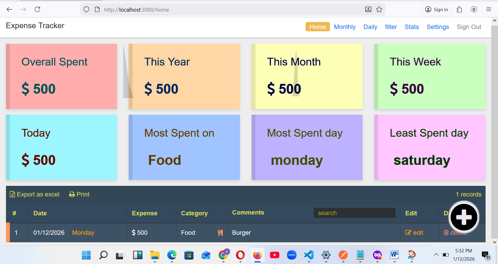

**Login Page**  
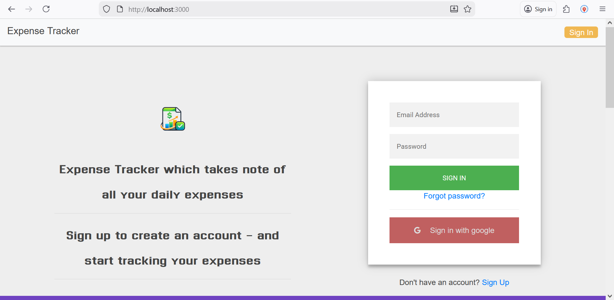

**Settings Page**  
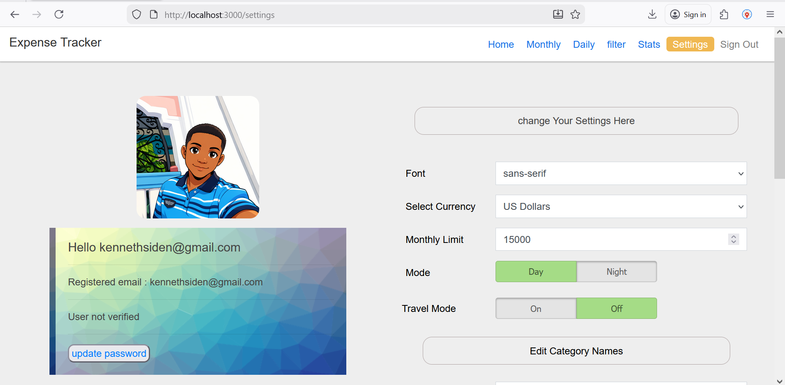

**Statistics Page**  
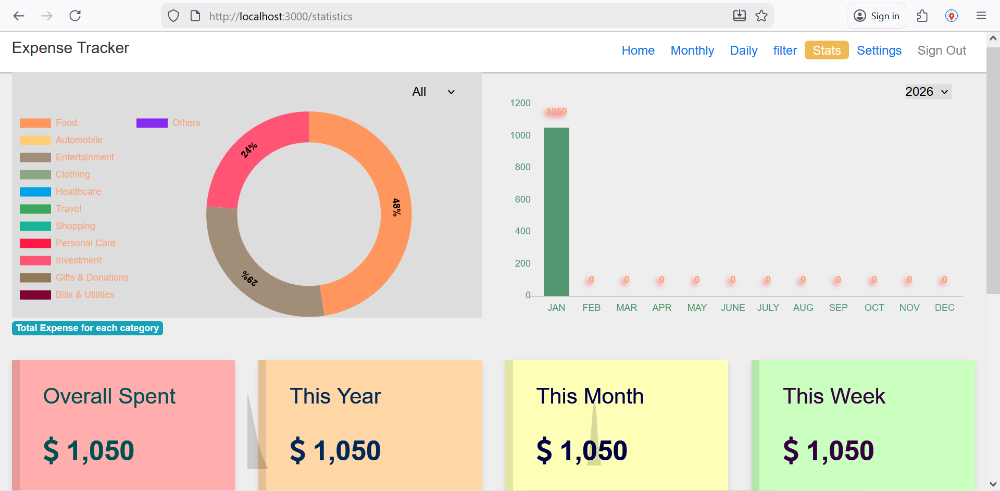

---

## 🔐 Environment Variables Summary

### Backend
```env
COSMOS_CONNECTION=...
```

### Frontend
```env
REACT_APP_API_BASE_URL=...
```

---

## 📝 Notes

- `.env.local` files are ignored
- Secrets are stored in Azure App Settings
- Backend and frontend deploy independently
- Firebase fully removed
- Serverless architecture for scalability

---

## 👨‍💻 Author

**Blessed Siden**  
Full-Stack Engineer | Cloud & Serverless  
GitHub: https://github.com/BlessedSiden1234
